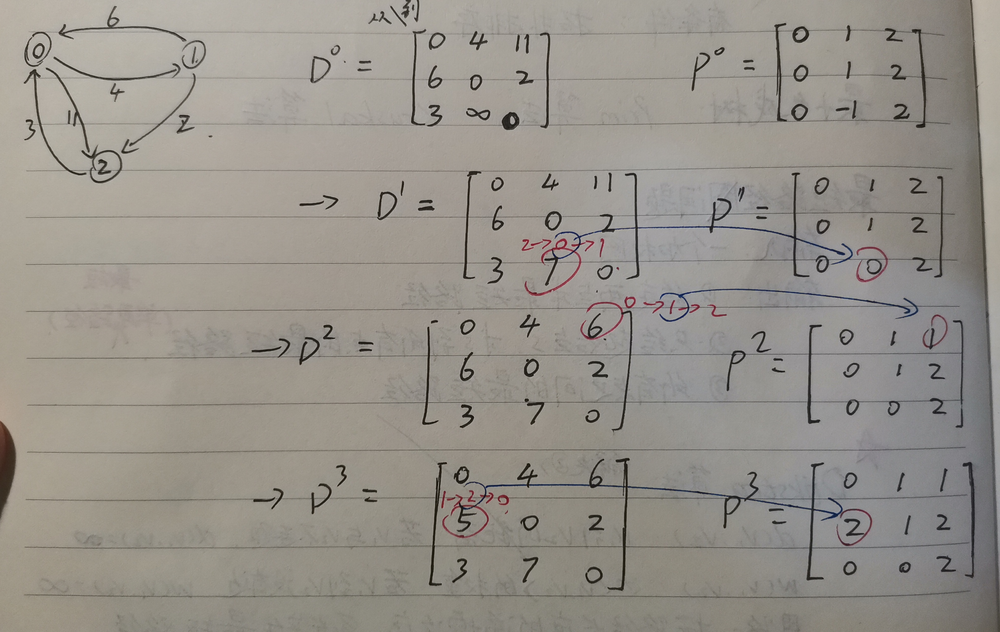

# 图

图的表示方式: 邻接矩阵, 邻接链表

#### 遍历

- 无条件的遍历: 深度优先搜索(DFS), 广度优先搜索(BFS)
- 有条件的遍历: 拓扑排序

#### 最小生成树

- **Prim算法**(从某一个点出发),
- **Kruskal算法**(从全局出发, 每次找最小的边, 并且这个边把原先不连通的点连通起来)

#### 最短路径问题

输入: 一个加权图

分类:

1. 给定两点求最短路径
2. 只给起始点\\(s\\), 求\\(s\\)到所有点的最短路径(**单源最短路径问题**)
3. 求所有点之间的最短路径

解决问题2: **Dijkstra算法**:

- \\(d(v_1, v_2)\\) : \\(v1\\)到\\(v2\\)的距离, 若\\(v1\\)与\\(v2\\)不连通, \\(d(v_1, v_2)=\infty\\)

- \\(w(v_1, v_2)\\) : 边\\(<v1,v2>\\)的权重, 若\\(v1\\)到\\(v2\\)没有边, \\(w(v_1, v_2)=\infty\\)

- 思路: 按路径长度的递增次序, 逐步产生最短路径

- \\(d(s,x) = {{\min}\atop{u \in U, x \in X}}(d(s,u)+w(u,x))\\) , \\(U\\): 已求得最短路径的顶点集, \\(X\\): 未求得最短路径的顶点集

- 用到: 一个改进过的邻接矩阵(自己手写做题时可以直接看图), \\(D\\)数组(\\(\mathrm{Distance}\\)), \\(P\\)数组(\\(\mathrm{Path}\\)), \\(M\\)数组(\\(\mathrm{Mark}\\))

解决问题3: Dijkstra算法做n次, 或者用**Floyd算法**

- k-path: 除去起点终点, 中间的节点下标都小于\\(k\\)

