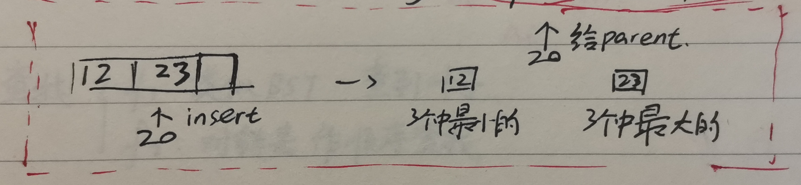

# 索引技术

## 2-3树

- 每个节点存1-2个key

- 中间节点存1个key时有2个儿子, 存2个key时有3个儿子

- 叶子节点深度相同

- key大小规则类似于BST

    

### 2-3树的各种操作

#### 查找

类似于BST, \\(O(logN)\\)

#### 插入

1. 找合适的叶子节点

2. 看看这个叶子有几个key

    1. 如果这个叶子原本只有一个key: 直接插入

    2. 如果这个叶子原本有2个key: **split-and-promote**
    
    3. 如果parent原本有3个key: 重复操作2
    
        split-and-promote图示:

#### 删除

被删掉的位置可能被其他key代替以维持2-3树的形状(在B树和B+树那里细讲)

## B树

- 2-3树的推广

- 节点key的数量: \\([[ \frac{1}{2}m]-1, m-1]\\)

- 儿子数量: \\([[ \frac{1}{2}m], m]\\)

## B+树

- B树的实现

- 需要\\(m, n\\)两个参数来初始化

- 中间节点只存key不存pointer, 叶子存key和pointer(pointer应该可以理解为指向实际文件位置的指针, key就是个索引), 中间节点存的key在叶子中能找到

- 对\\(m\\)阶B+树:

    - 根节点关键字数量: \\([1, m-1]\\)

    - 其他内部节点关键字数量: \\([[ \frac{m}{2}]-1, m-1]\\)

    - 叶子节点关键字/记录指针对数量: \\( [ [\frac{n}{2}, n] \\) **(注意m, n可以不相等)**

    - 叶子彼此相连构成有序链表, 头指针指向含最小关键字的节点

    - 内部节点只有关键字, 记为\\(K_1, K_2, \cdots\\) , 记子树为\\(A_0, A_1, A_2, ...\\) , 则有\\(\min(A_i) \geq K_i\\) , \\(\max(A_{i-1}) < K_i\\)

        

### B+树的各种操作

#### 查找

- \\(f_1\\): 类似BST, 一直查到叶子才能停止

- \\(f_2\\): 对链表做顺序查找  

#### 插入

- 可能发生split-and-promote
- 叶子节点: promote的是key**的一个复制**
- 中间节点: promote的是key**本身**

#### 删除

从叶子中删record, 若造成叶子达不到半满( \\(< [\frac{n}{2}] \\) ) , 看其兄弟可否分给它一些record

- 如果能,则分过去, 同时**依据大小关系更新父节点的key**
- 如果不能, 则自己的所有record给邻居, 删掉自己, 同时更新父节点. 如果父节点达不到半满, 重复此过程.
- 父节点的合并没总结出规律来, 靠直觉, 可能造成B+树高度下降

### 补充

不看叶子, B+树的上半部分就是棵B树. 任何节点的合并会引起父节点key的下移, 可能造成高度减小
